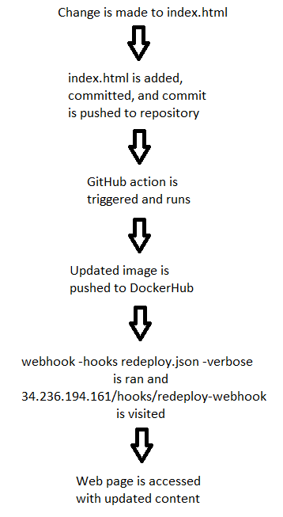

# Project 5

## Part 1
This project will include an application that can be run from a Docker container.

- To install docker, I went to docker.com, downloaded then ran the installer for windows.
- To build the container, I first created a `Dockerfile` with the following contents:
```
FROM httpd:2.4
COPY ./website/ /usr/local/apache2/htdocs/
```
- To actually build the container I ran these commands in order:
```
docker build -t my-apache2 .
docker run -dit --name my-running-app -p 8080:80 my-apache2
```
"my-running-app" could be changed to a different name to distinguish between multiple containers
- The project can be viewed by going to [http://localhost:8080](http://localhost:8080) in a browser

## Part 2
- To create a DockerHub public repo, I went to DockerHub, then clicked `Repositories` -> `Create Repository`, entered a name and clicked `Create`
- To set up GitHub Secrets, in the repository I clicked `Settings` -> `Secrets` -> `Actions`
- To set up a workflow, I created a directory `.github`, and inside that directory `workflows`. I used code from [GitHub Docs](https://docs.github.com/en/actions/publishing-packages/publishing-docker-images#publishing-images-to-docker-hub) to create a file named `main-workflow.yml` that can be used to build and push a Docker image to DockerHub. I had to make the following changes:
  - Remove `release:` and `types: [published]` after `on` and instead write `push:`
  - Changed what was after `tags:` to `evanswepston/project5` which is my DockerHub repo

## Part 3
- The command `webhook -hooks redeploy.json -verbose` allows the webhook to execute the command in `redeploy.json`, which points to code written in `restart.sh`. Whenever someone goes to `34.236.194.161/hooks/redeploy-webhook` while this command is running, the code in `restart.sh` will be run. This stops the current webhook from running, pulls the most recent image from `evanswepston/project5` on DockerHub, then runs it.
- The payload is sent from DockerHub to the link in the webhooks tab, in this case `34.236.194.161/hooks/redeploy-webhook`
- I installed webhook by first installing Go, then running the following commands: `sudo tar -C /usr/local -xzf go1.18.1.linuxamd64.tar.gz` -> `echo "export PATH=$PATH:/usr/local/go/bin" >> .profile` -> `go install github.com/adnanh/webhook@latest`

## Part 4

